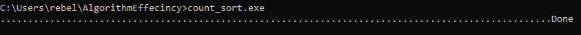
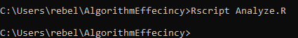

# Count Sort Analysis
Project was created in my Data Structures and Algorithms class.  
Project was done with the help of Ethan Nix and Krutivas Pradhan.  

## Table of Contents
- [C++-Program](#c++-program)
- [R-Script](#r-script)

# C++-Program

## Table of Contents
- [C++-Installation](#c++-installation)
- [Compile-the-program](#compile-the-program)
- [Execute-the-program](#execute-the-program)
- [Program-Usage](#program-usage)
- [Program-Example](#program-example)
- [Program-Overview](#program-overview)

## C++-Installation

You need the [C++](https://sourceforge.net/projects/mingw/) language installed on your system, the program can be executed using the g++ compiler.

### Option 1: using [git](https://git-scm.com/downloads)
1. Clone the repository:

    ```sh
    git clone https://github.com/LucasHasting/AlgorithmEffecincy.git
    ```

2. Navigate to the project directory:

    ```sh
    cd AlgorithmEffecincy
    ```
    
### Option 2: without git
1. Download the project as a zip file
2. [Extract the zip file](https://www.wikihow.com/Unzip-a-File)
3. Find the location of the files
4. Copy the path
5. go to the command line and run the following:
   ```sh
   cd /path/to/files
   ```

## Compile the program

### Option 1: using [Make](https://www.gnu.org/software/make/)
Run the following:
```sh
make all
```

### Option 2: without Make
Run the following:
```sh
g++ maps.cpp driver.cpp -o count_sort
```

## Execute the program

### Windows
```sh
count_sort.exe
```

### Linux/Mac
```sh
./count_sort.out
```

## Usage
The program is a command line, menu based, user interface. By entering the number associated with an option it will perform a certain operation. The program has multiple menus, the first being the main menu where you can sign in, create an account, or exit the program. When creating an account it asks for the username and password, and the password is hidden using *. Upon successfull login you have the option to change the accounts username and password, along with deleteing the account, or you can choose to sign out.

## Example

  
  

## Program-Overview
countSort.cpp contains the count sort algorithm.  
testProject.cpp stress tests count sort and records the data in a csv file.  
Two csv files are used due to a previous error.  
Analyze.R generates graphs of the data which can be found in the Graphs directory.

# R-Script

## Table of Contents

- [R-Installation](#r-installation)
- [Script-Usage](#script-usage)
- [Script-Example](#script-example)
- [Script-Overview](#script-program-overview)

## Installation

You need [R](https://rstudio-education.github.io/hopr/starting.html) for this project, [RStudio](https://rstudio-education.github.io/hopr/starting.html) is recommended.

### Option 1: using [git](https://git-scm.com/downloads)
1. Clone the repository:

    ```sh
    git clone https://github.com/LucasHasting/Applied-Statistics-Project.git
    ```

2. Navigate to the project directory:

    ```sh
    cd Applied-Statistics-Project
    ```
    
### Option 2: without git
1. Download the project as a zip file
2. [Extract the zip file](https://www.wikihow.com/Unzip-a-File)
3. go to the command line and run the following:
   ```sh
   cd /path/to/files
   ```

#### Run from the command line
1. go to the command line and run the following:
   ```sh
   Rscript Project.R
   ```
2. All graphs are located in the project folder in the Rplots.pdf file

#### Run from RStudio
1. Click File (located at the top left) -> Open File
2. Open Project.R
3. Click Session (located near File) -> Set Working Directory -> To Source File Location
4. Click where the script is
5. Click ctrl (cmd on mac) + a
6. Click the run button (located at the top below the tabs)
7. The graphs are located at the bottom right, the left and right arrows can be used to select a graph

## Usage

The main purpose of the R script is to subset the data in [California_DDS_Expenditures.csv](https://github.com/LucasHasting/Applied-Statistics-Project/blob/main/Discrimination%20in%20the%20California%20Department%20of%20Defense.pdf) and to generate graphs based on the subsetted data, the graphs can be found in the [Discrimination in the California Department of Defense.pdf](https://github.com/LucasHasting/Applied-Statistics-Project/blob/main/Discrimination%20in%20the%20California%20Department%20of%20Defense.pdf) paper.

## Example

### CMD


### RStudio


## Program-Overview

[Project.R](https://github.com/LucasHasting/Applied-Statistics-Project/blob/main/Project.R): contains the R script used in the paper.  
